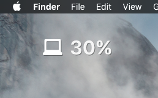

# Simple Übersicht System Battery Widget

A simple system battery status widget. Just something I put together quick. Feel free to contribute and improve.

To enable, place the `systembatt.widget` folder in your `Übersicht/widgets` directory.

## Todo:
- Charging indicator
- Current number of cycles

Get more widgets at [Übersicht][1]!

[1]: http://tracesof.net/uebersicht-widgets/
